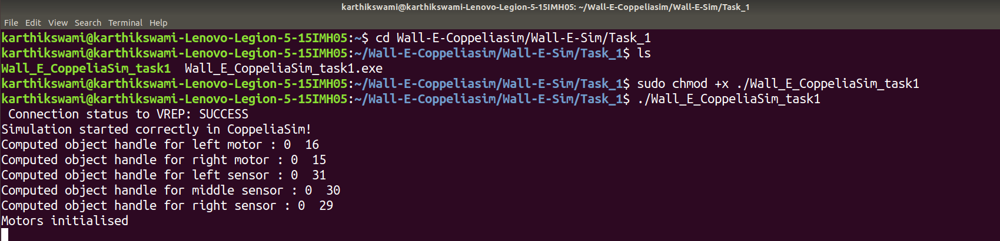

# Installation (if not done already)


* Clone this git repository :
```
  git clone https://github.com/MOLOCH-dev/Wall-E-Sim.git
```
* Download MinGW on Windows following [these instructions](https://code.visualstudio.com/docs/cpp/config-mingw) 

# Task 1

Task 1 is to tune the bot i.e. to check for the motion of the bot by changing the values of **K<sub>p</sub>** , **K<sub>i</sub>**, **K<sub>d</sub>**

## **Proportional-Integral-Derivative (PID) :** 

PID is the mechanism through which we can control the motion of line following bot which is dependent on few terms given below in the equation


where 
  1)  **K<sub>p</sub>e(t)** is the P term which basically says that (in terms of the line) your error increases as you go away from the line.
  2) **K<sub>i</sub>∫e(t)dt** is the I term which just accumulates the error overtime by summing it continuously.
  3) **K<sub>d</sub> de(t)/dt** is the D term and is just to damp(decrease the error) and bring back to the line , so while damping it will oscillate

  Here in the equation, **K<sub>p</sub>** , **K<sub>i</sub>**, **K<sub>d</sub>** are constants

## In Simulation ---->

So when you run the simulation you will get a PID Tuning Window where you can change the values of **K<sub>p</sub>** , **K<sub>i</sub>**, **K<sub>d</sub>** here

<p align="center">
  
</p>


* When you put only **K<sub>p</sub>** term :

<p align="center">
  
</p>


* When you put only **K<sub>i</sub>** term :

<p align="center">
  
</p>


* When you put only **K<sub>d</sub>** term :

<p align="center">
  
</p>


# Run the code

## For Windows ------>


* Open the scene in CoppeliaSim <br>
Go to *Desktop→Wall-E-Coppeliasim→Wall-E-Sim→scenes* <br>
Then just open the WallE_line_follow.ttt file 
<p align="center">
  
</p>

* Go to *Desktop→Wall-E-Coppeliasim→Wall-E-Sim→Task_1* and just double click on *Wall_E_CoppeliaSim_task1.exe*

<p align="center">
  
</p>

* Then in Coppeliasim just change the values in sliders and complete the task

<br>

## For Ubuntu ------>
1. Open the terminal and go to the directory where you have extracted the tar.xz file of Coppeliasim and then open the Coppeliasim scene
```
    cd <path_to_Coppeliasim_directory>
    ./coppeliaSim.sh
```
**"If the tar.xz is not extracted go to the Downloads Folder and Extract anywhere, then cd to that folder"**

* After the scene opens go to *File→Open Scene*
and window will open up where you have to navigate like this
*home/username/Wall-E-Coppeliasim/Wall-E-Sim/scenes* <br>
* Now Open WallE_line_follow.ttt
<p align="center">
  
</p>


2. Open new terminal and Navigate to the Directory where you cloned the repository and execute the following commands:
```
   cd <path_to_cloned_directory>
   cd Task_1
```

3. Next run this command to give permission
```
   sudo chmod +x ./Wall_E_CoppeliaSim_task1
```

4. Now Run the given executable by typing the following command in your Terminal and pressing enter
 ```
   ./Wall_E_CoppeliaSim_task1
```
**NOTE :** You can type ./W and press tab, the terminal will automatically detect the exe file


<p align="center">
  
</p>
