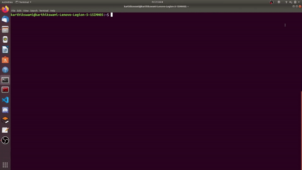

# Wall-E-Sim
A line follower simulation created in CoppeliaSim, with a C++ interface for CoppeliaSim's Remote API

This is a simuation of [SRA's Wall-E bot](https://github.com/SRA-VJTI/Wall-E_v2.2-beta/tree/dev)

<p align="center">
  
</p>


# Installation

* Download CoppeliaSim Edu 4.0.0 for Windows 64-bit OS from [here](https://www.coppeliarobotics.com/files/CoppeliaSim_Edu_V4_0_0_Setup.exe) (file size - 161MB).
* Download [Visual Studio Code](https://code.visualstudio.com/download), if you haven't already


## Cloning For Windows ----->
<br>
**NOTE**: If you have already Cloned, run the following commands to get the updated version of the repository :<br>

* Open the terminal(cmd)
* Go to the cloned directory (Wall-E-Coppeliasim/Wall-E-Sim) and run the following command
```
  git --version
  git pull
``` 

**If you have not cloned the repo :**<br>

*You can do this in cmd*
* Go to User Profile :
```
cd C:\Users\name
```

* Make a new folder and git init  :
```
mkdir Wall-E-CoppeliaSim
cd Wall-E-CoppeliaSim
git init
```

* Clone this git repository while in the same folder :
```
git clone https://github.com/SRA-VJTI/Wall-E-Sim.git
```
**Refer this video (if required)**<br>
<p align="center">
  
</p>


## Cloning For Linux ----->
<br>
**NOTE**: If you have already Cloned, run the following commands to get the updated version of the repository :<br>

* Open the terminal
* Go to the cloned directory (Wall-E-Coppeliasim/Wall-E-Sim) and run the following command
```
  git --version
  git pull
``` 
**If you have not cloned the repo :**<br>

* Make a new folder and git init  :
```
mkdir Wall-E-CoppeliaSim
cd Wall-E-CoppeliaSim
git init
```

* Clone this git repository while in the same folder :
```
git clone https://github.com/SRA-VJTI/Wall-E-Sim.git
```
**Refer this video (if required)**<br>
<p align="center">
  
</p>
<br>

After Cloning you can now see all the files and folders present in your device and now you can proceed with tasks by just going to the respective task folder and there you will find more instructions.


