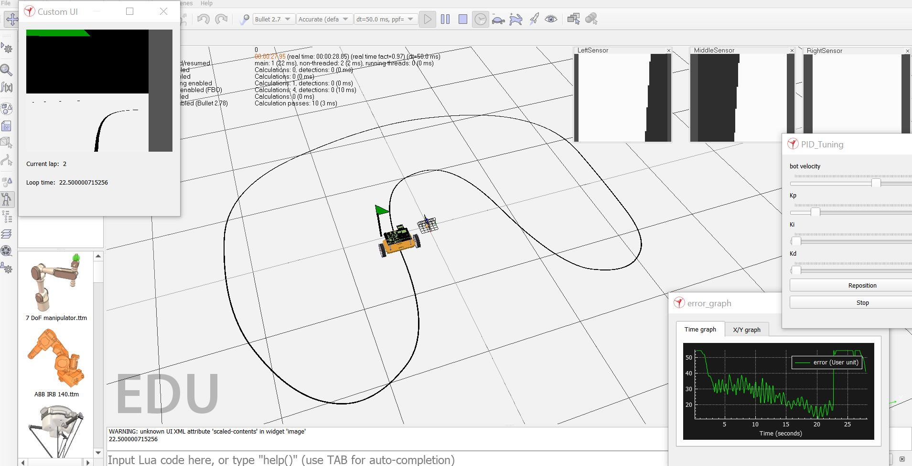
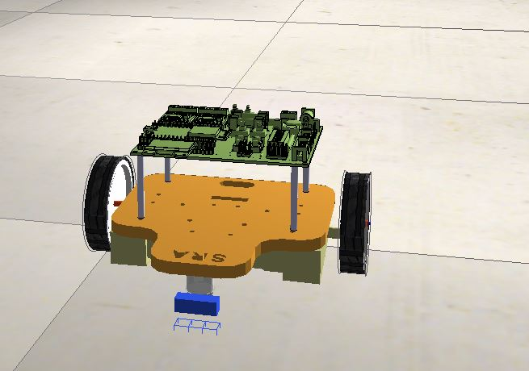

# Wall-E-Sim
A line follower simulation created in CoppeliaSim, with a C++ interface for CoppeliaSim's Remote API

This is a simuation of [SRA's Wall-E bot](https://github.com/SRA-VJTI/Wall-E_v2.2-beta/tree/dev)

<p align="center">
  
</p>


# Installation

* Download CoppeliaSim Edu 4.0.0 for Windows 64-bit OS from [here](https://www.coppeliarobotics.com/files/CoppeliaSim_Edu_V4_0_0_Setup.exe) (file size - 161MB).
* Download [Visual Studio Code](https://code.visualstudio.com/download), if you haven't already


* Clone this git repository :
```
git clone https://github.com/MOLOCH-dev/Wall-E-Sim.git
```

# Run the code
Open _scenes/WallE_line_follow.ttt_ in V-REP. You should see the Wall-E line-follower path, three vision sensor floating views, and a white floor with a black line. 
<p align="center">
  
</p>


Run the executable file in _bin/Wall_E_CoppeliaSim.exe_ (Right-click -> Open). This will run the main script _src/line_follow.cpp_
<p align="center">
  
</p>

Sample images of the run:

<p align="center">
  
  
  
  
  
</p>


# Todo :

