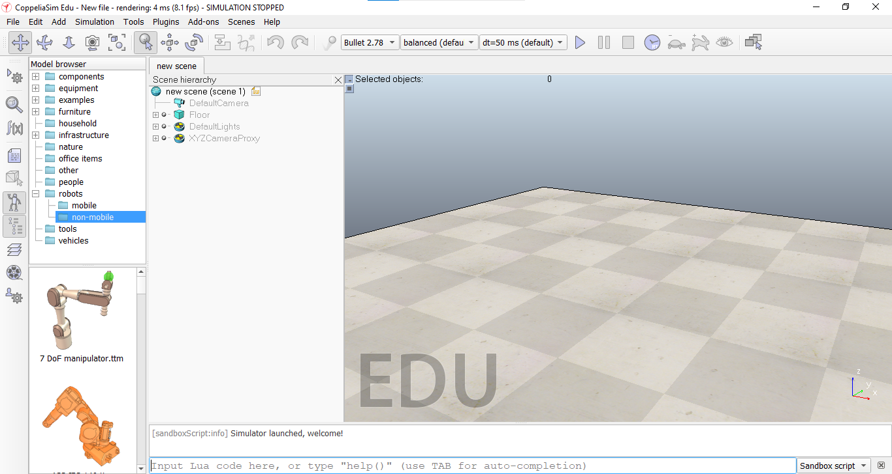
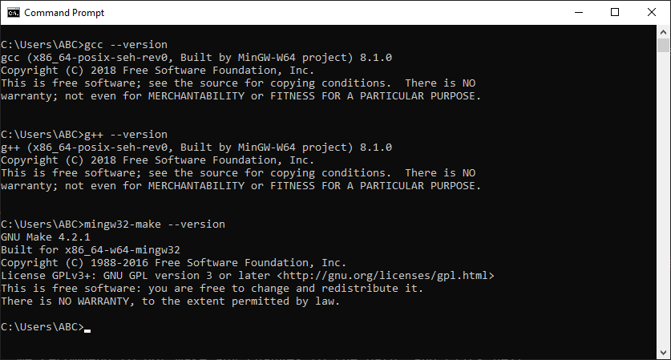
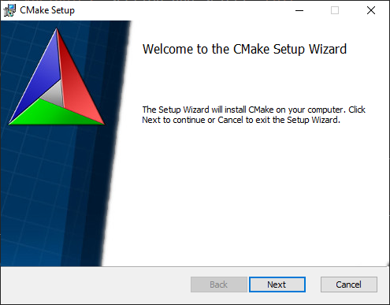
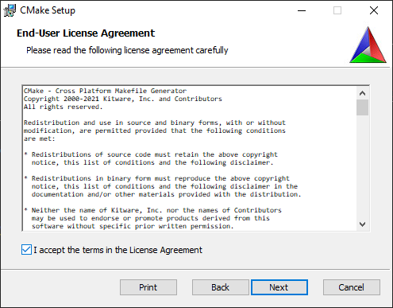
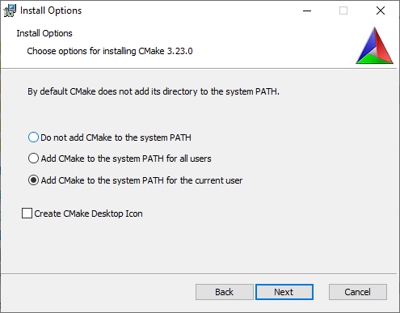
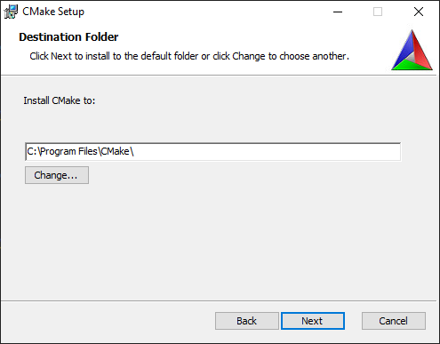
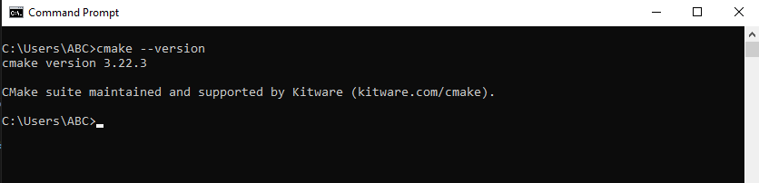
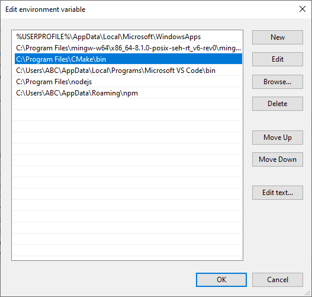
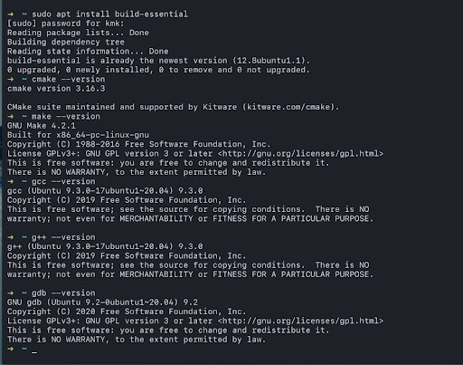

# Wall-E-v2.3 - Simulation

## This is a simulation of [SRA's Wall-E bot](https://github.com/SRA-VJTI/Wall-E) in CoppeliaSim software

<p align="center">
  
</p>

### Installation

- [For Windows](#for-windows)
- [For Linux](#for-linux)
- [For MacOS](#for-macos)


## For Windows

### The first step is to install CoppeliaSim Robotics Simulator Platform

1. Download CoppeliaSim Edu 4.2.0 for Windows 64-bit OS from [here](https://www.coppeliarobotics.com/files/CoppeliaSim_Edu_V4_2_0_Setup.exe) (file size - 155MB)

2. Navigate to the downloaded .exefile and double-click it to install the software

3. Once the installation is complete, a shortcut icon to launch the software would have been created on your Desktop. Double-click to launch it. CoppeliaSim will open as shown in Figure with the default scene loaded

    <p align="center">
    
    </p>


### Download [Visual Studio Code](https://code.visualstudio.com/download), if you haven't already (optional)

### Next step is to verify if MinGW is installed

To check whether MinGW is installed type the following commands in command prompt terminal.

```
    gcc --version
    g++ --version
    mingw32-make --version
```

<p align="center">
    
</p>

### MinGW (ONLY IF YOU DO NOT HAVE MinGW INSTALLED)

 
1. [Installation link](https://sourceforge.net/projects/mingw/files/Installer/)

2. [Installation guide](https://code.visualstudio.com/docs/cpp/config-mingw) and [Video Reference](https://youtu.be/BK_ciBOXWr0)

3. Once downloaded, Open the MinGW Installer and click on install

4. We recommend to not make any changes to the path, and click next

5. Click on continue and it will open the installation manager

6. Right click on the check-box and then click on Mark for installation

7. Once you select all, go to Installation and click on Apply Changes

### To Setup MinGW As Environmental Variable

8. Go to the Search bar and type `Environment` Click on `Edit the System Environment Variables`

9. Click on `Environment Variables`

10. Click on `Path` under `System Variables` section and select `Edit`.

11. Click on `New` and copy the file path to MinGW/bin ( C:\MinGW\bin ) and then click on `ok`

12. Verify [installation of MinGW](#next-step-is-to-verify-if-mingw-is-installed)

### Installing CMake

1. Download CMake for 64 bit Windows from [here](https://github.com/Kitware/CMake/releases/download/v3.22.3/cmake-3.22.3-windows-x86_64.msi).

    Download CMake for 32 bit Windows from [here](https://github.com/Kitware/CMake/releases/download/v3.22.3/cmake-3.22.3-windows-i386.msi).

2. Navigate to your downloads folder and click on the CMake Installer. CMake Setup Wizard will open and click on Next.

    <p align="center">
        
    </p>

3. Select the accept terms checkbox and click on next.

    <p align="center">
        
    </p>

4. Important Step : Click on Add CMake to system PATH for current user.

    <p align="center">
        
    </p>

5. Click on Next.

    <p align="center">
        
    </p>

6. Click on Install and Yes in further dialog box to finish install.

### Add CMake to Path Environment variable

7. To verify if CMake is installed properly run the following command in command prompt.

    ```
        cmake --version
    ```

    If the output is similar to below figure you have completed your installation and skip rest of the steps. If not proceed further.

    <p align="center">
        
    </p>

7. Go to the Search bar and type `Environment` Click on `Edit the System Environment Variables`

8. Click on `Environment Variables`

9. Click on `Path` under `System Variables` section and select `Edit` .

10. Click on `New` and copy the file path to CMake/bin (`C:\Program Files\CMake\bin`) and then click on `ok`.

    <p align="center">
        
    </p>

## For Linux

### The first step is to install CoppeliaSim Robotics Simulator Platform

1. Download CoppeliaSim Edu 4.2.0 for Ubuntu 20.04 64-bit OS from [here](https://www.coppeliarobotics.com/files/CoppeliaSim_Edu_V4_2_0_Ubuntu20_04.tar.xz). It will download as .tar.xz (compressed zip) file.

   To download CoppeliaSim for Ubuntu 18.04 64-bit OS, click [here](https://www.coppeliarobotics.com/files/CoppeliaSim_Edu_V4_2_0_Ubuntu18_04.tar.xz).

   To download CoppeliaSim for Ubuntu 16.04 64-bit OS, click [here](https://www.coppeliarobotics.com/files/CoppeliaSim_Edu_V4_2_0_Ubuntu16_04.tar.xz).

2. Open Terminal and navigate to the directory where this file was downloaded. Run the following command (based on your OS version ie replace 20_04 with 18_04 if using Ubuntu 18-04)

   ```
       tar -xf CoppeliaSim_Edu_V4_2_0_Ubuntu20_04.tar.xz
   ```

3. This command will decompress and extract the CoppeliaSim software to the folder named CoppeliaSim_Edu_V4_2_0_Ubuntu20_04 in the same directory. Now type the below commands in sequence to launch CoppeliaSim.
   ```
       cd CoppeliaSim_Edu_V4_2_0_Ubuntu20_04
       ./coppeliaSim.sh
   ```
4. You will see the output as shown in Figure. CoppeliaSim will open with the default scene loaded.

    <p align="center">
    
    </p>


### Build Essential

1. On the terminal, type

   ```
   sudo apt install build-essential 
   cmake --version 
   make --version
   ```

    Output:
    <p align="center">
        
    </p>

Note : Your version of cmake may be different than what is shown above. Cmake version of 3.10.x and above is acceptable.

## For MacOS

### Coppeliasim

1. Download CoppeliaSim Edu 4.2.0 for MacOS 10.15 from [here](https://www.coppeliarobotics.com/files/CoppeliaSim_Edu_V4_2_0_macOS10_15.zip). 

   Download CoppeliaSim Edu 4.2.0 for MacOS 10.13 from [here](https://www.coppeliarobotics.com/files/CoppeliaSim_Edu_V4_2_0_macOS10_13.zip).
   
   Save the file in the Downloads folder.
   
2. Extract the File in Downloads folder
3. Open Terminal (command+space, type terminal) and Run the following command:

    ```
    cd ~/Downloads/CoppeliaSim_Edu_V4_2_0_Mac

    sudo xattr -r -d com.apple.quarantine *
    ```

4. Open finder, go to downloads, then click on `coppeliaSim`.
5. Voila everything is done
