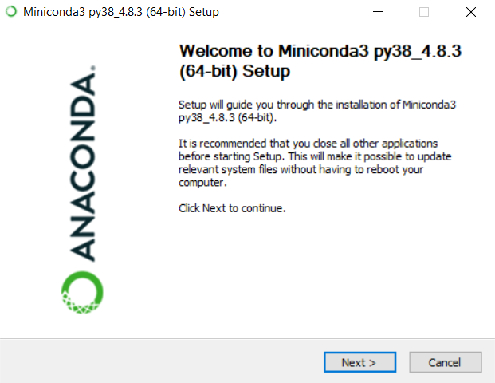
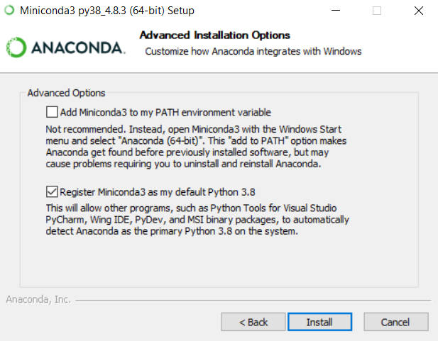
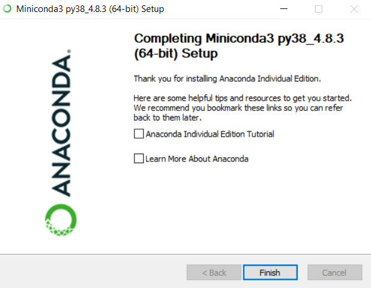
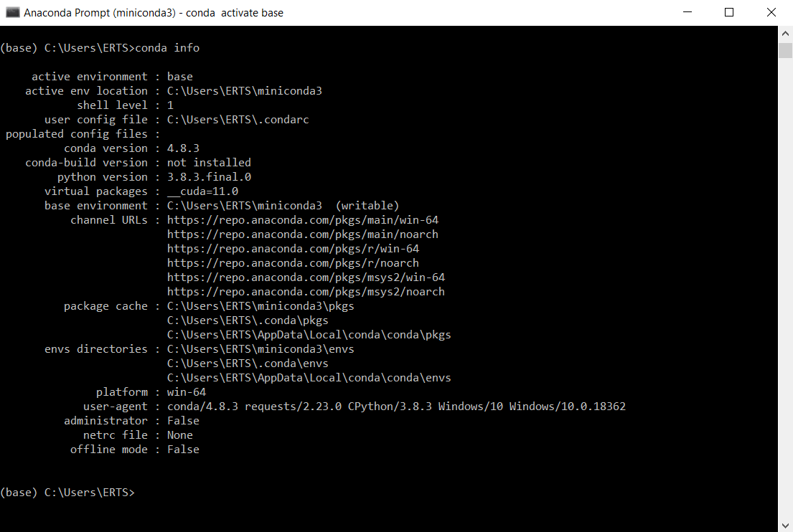
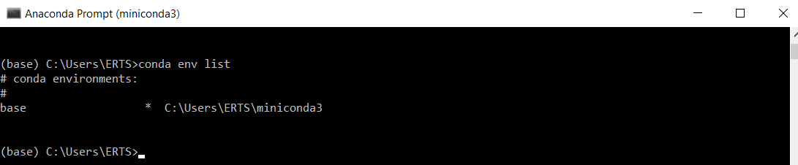
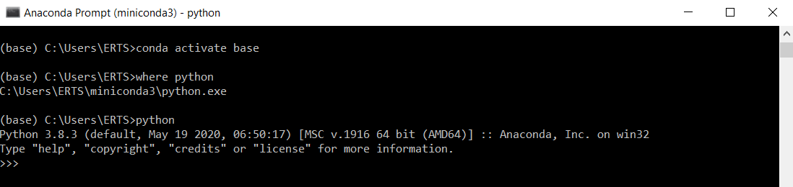
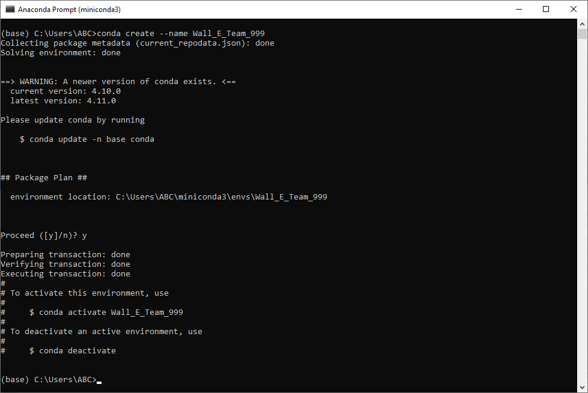
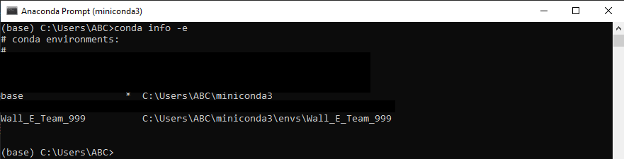
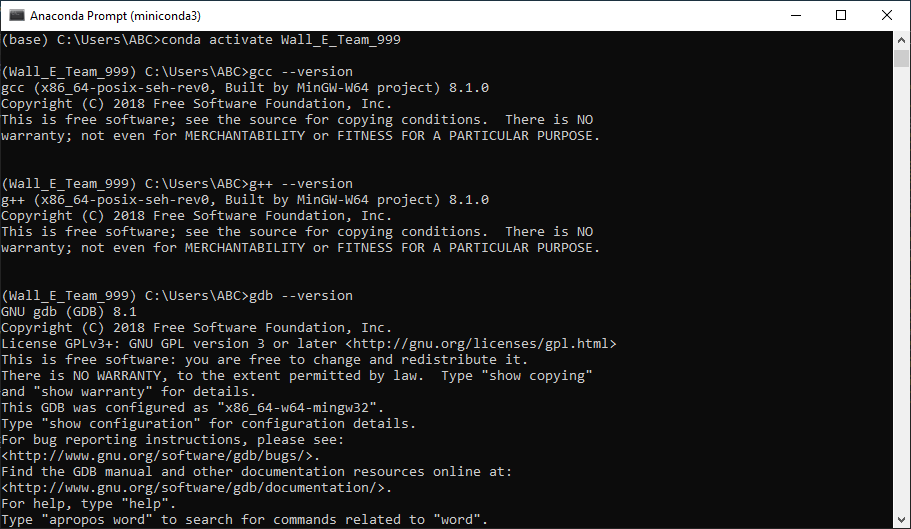
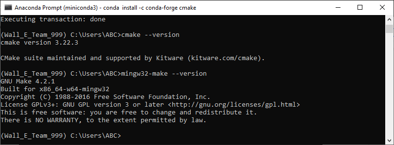

# Wall-E-v2.3 - Simulation

## This is a simulation of [SRA's Wall-E bot](https://github.com/SRA-VJTI/Wall-E) in CoppeliaSim software

<p align="center">
  
</p>

### Installation

- [For Windows](#for-windows)
- [For Linux](#for-linux)
- [For MacOS](#for-macos)


## For Windows

### The first step is to install CoppeliaSim Robotics Simulator Platform

1. Download CoppeliaSim Edu 4.2.0 for Windows 64-bit OS from [here](https://www.coppeliarobotics.com/files/CoppeliaSim_Edu_V4_2_0_Setup.exe) (file size - 155MB)

2. Navigate to the downloaded .exefile and double-click it to install the software

3. Once the installation is complete, a shortcut icon to launch the software would have been created on your Desktop. Double-click to launch it. CoppeliaSim will open as shown in Figure with the default scene loaded

    <p align="center">
    
    </p>


### Download [Visual Studio Code](https://code.visualstudio.com/download), if you haven't already (optional)


### MinGW (ONLY IF YOU DO NOT HAVE MINGW INSTALLED)

1. [Installation link](https://sourceforge.net/projects/mingw/files/Installer/)

2. [Installation guide](https://code.visualstudio.com/docs/cpp/config-mingw) and [Video Reference](https://youtu.be/BK_ciBOXWr0)

3. Once downloaded, Open the MinGW Installer and click on install

4. We recommend to not make any changes to the path, and click next

5. Click on continue and it will open the installation manager

6. Right click on the check-box and then click on Mark for installation

7. Once you select all, go to Installation and click on Apply Changes

### To Setup MinGW As Environmental Variable

8. Go to the Search bar and type `Environment` Click on `Edit the System Environment Variables`

9. Click on `Environment Variables`

10. Click on `Path` under `System Variables` section and select `Edit`.

11. Click on `New` and copy the file path to MinGW/bin ( C:\MinGW\bin ) and then click on `ok`

12. Verify installation by opening command prompt or PowerShell and typing

```
    gcc --version
```


### Miniconda Installation (For Python 3.8)

1. Download miniconda for Windows 64-bit from [here](https://repo.anaconda.com/miniconda/Miniconda3-py38_4.8.3-Windows-x86_64.exe) (If you have a 64-bit OS)

   Download miniconda for Windows 32-bit from [here](https://repo.anaconda.com/miniconda/Miniconda3-latest-Windows-x86.exe) (If you have a 32-bit OS)

2. Navigate to the downloaded .exe file of miniconda and double-click it. You would be greeted with a screen as shown below.

    <p align="center">
        
    </p>

3. Click on I Agree to accept the terms of agreement

4. Leave the default Just Me selected and click Next.

5. Leave the destination folder to install Miniconda untouched. Note: If the directory path contains any spaces, it will throw a Warning ! saying that the directory name should not contain spaces but that's okay, click OK.

6. Select Register Miniconda3 as my default Python 3.8.

    <p align="center">
        
    </p>

7. Click on Install.

8. Click Next when the installation completes. Skip the optional installation of Microsoft Visual Studio Code by clicking Skip, as we will install it manually later.

9. Un-check the two boxes as shown in Figure and click Finish.

    <p align="center">
        
    </p>

### Miniconda Install Verification

1. Search for Anaconda Prompt (miniconda3) in the Start menu. Open it

2. Type the following command in the prompt which has popped up.

   ```
       conda info
   ```

   You will get the following output :

   <p align="center">
       
   </p>

3. Type out the following command

   ```
       conda info -e
   ```

   Output :

   <p align="center">
       
   </p>

4. To activate the default Python environment that comes with Miniconda installation, type in following in sequence

   ```
       conda activate base
       where python
       python
   ```

   You will see output similar to Figure 6. What we did here is, first we invoked the default environment, then checked whether the prompt is able to detect the path of Python that came installed with Miniconda and at last we called the Python interpreter or console, you can see the very first message has Anaconda word which justifies it.

   <p align="center">
       
   </p>

5. The Python version (3.8.3) might be different at your end but that's okay as long as it is 3.8.x. Type exit() to come out of the Python console.

6. Create a new environment in conda (replace 999 with your team id)

   ```
       conda create --name Wall_E_Team_999
   ```

   <p align="center">
       
   </p>

7. Verify if the environment was created using the command

   ```
       conda info -e
   ```

   <p align="center">
       
   </p>

8. Activate the enviroment created and verify gcc installation on conda

   ```
       conda activate Wall_E_Team_999
       gcc --version
       g++ --version
       gdb --version
   ```

   <p align="center">
       
   </p>

9. Install cmake on conda

   ```
       conda install -c conda-forge cmake
       cmake --version
       mingw32-make --version
   ```
   <p align="center">
       
   </p>

## For Linux

### The first step is to install CoppeliaSim Robotics Simulator Platform

1. Download CoppeliaSim Edu 4.2.0 for Ubuntu 20.04 64-bit OS from [here](https://www.coppeliarobotics.com/files/CoppeliaSim_Edu_V4_2_0_Ubuntu20_04.tar.xz). It will download as .tar.xz (compressed zip) file.

   To download CoppeliaSim for Ubuntu 18.04 64-bit OS, click [here](https://www.coppeliarobotics.com/files/CoppeliaSim_Edu_V4_2_0_Ubuntu18_04.tar.xz).

   To download CoppeliaSim for Ubuntu 16.04 64-bit OS, click [here](https://www.coppeliarobotics.com/files/CoppeliaSim_Edu_V4_2_0_Ubuntu16_04.tar.xz).

2. Open Terminal and navigate to the directory where this file was downloaded. Run the following command (based on your OS version ie replace 20_04 with 18_04 if using Ubuntu 18-04)

   ```
       tar -xf CoppeliaSim_Edu_V4_2_0_Ubuntu20_04.tar.xz
   ```

3. This command will decompress and extract the CoppeliaSim software to the folder named CoppeliaSim_Edu_V4_2_0_Ubuntu20_04 in the same directory. Now type the below commands in sequence to launch CoppeliaSim.
   ```
       cd CoppeliaSim_Edu_V4_2_0_Ubuntu20_04
       ./coppeliaSim.sh
   ```
4. You will see the output as shown in Figure. CoppeliaSim will open with the default scene loaded.

    <p align="center">
    
    </p>


### Build Essential

1. On the terminal, type

   ```
   sudo apt install build-essential cmake --version make --version
   ```

    Output:
    <p align="center">
        
    </p>

Note : Your version of cmake may be different than what is shown above. Cmake version of 3.10.x and above is acceptable.

## For MacOS

### Coppeliasim

1. Download CoppeliaSim Edu 4.0.0 for MacOS 64-bit OS from here(file size - 250MB). Save the file in the Downloads folder.
2. Extract the File in Downloads folder
3. Open Terminal(command+space, type terminal) and Run the following command:

    ```
    cd ~/Downloads/CoppeliaSim_Edu_V4_0_0_Mac

    sudo xattr -r -d com.apple.quarantine *
    ```

4. Open finder, go to downloads, then click on `coppeliaSim`.
5. Voila everything is done
