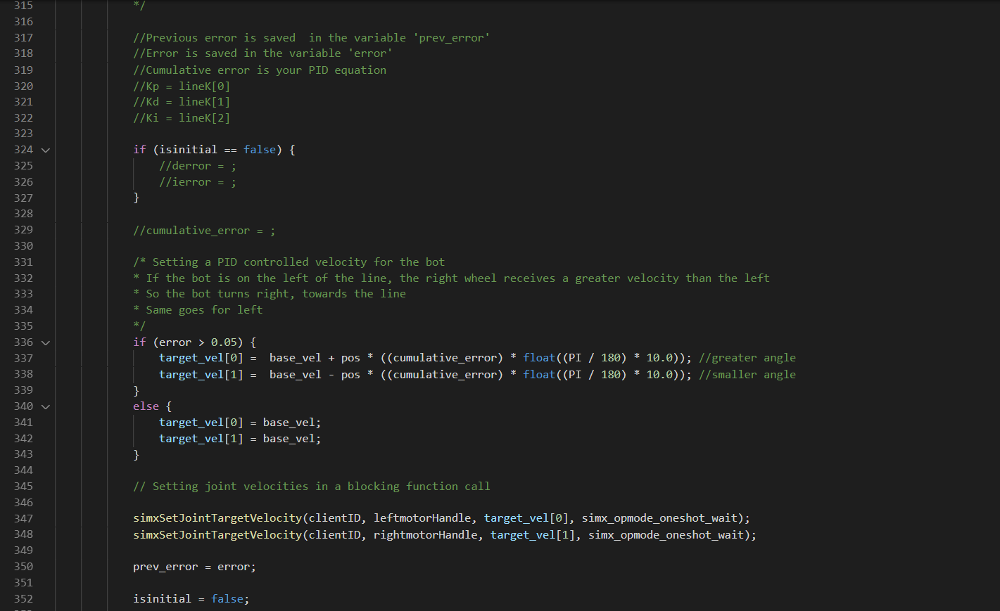
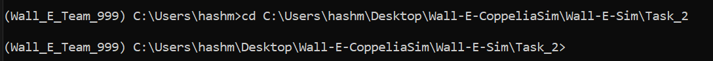
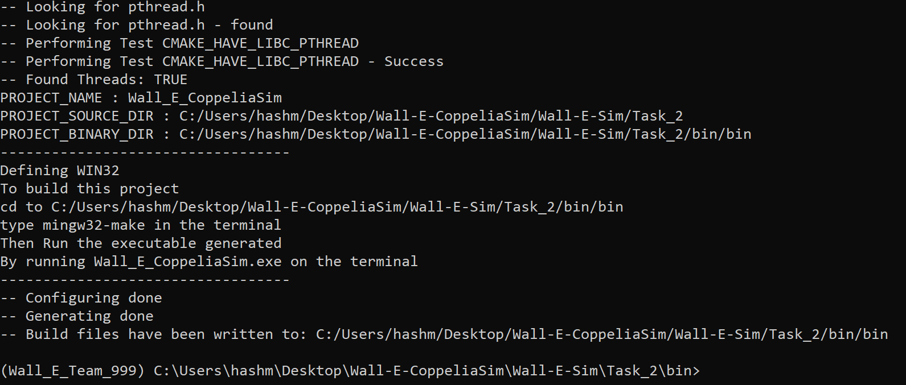
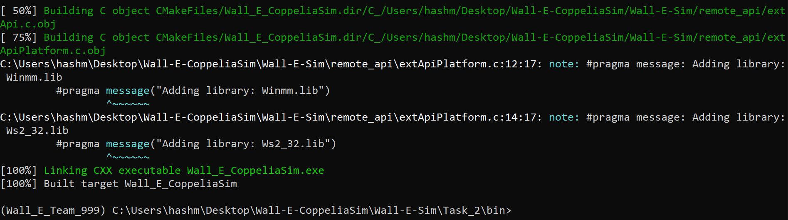
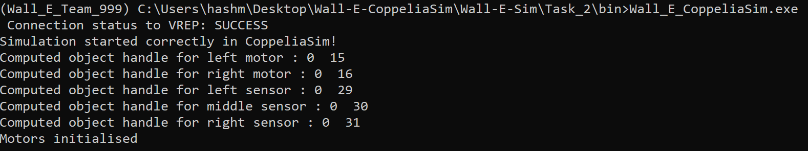

# Installation (if not done already)


* Clone this git repository :
```
  git clone https://github.com/MOLOCH-dev/Wall-E-Sim.git
```
* Download MinGW on Windows following [these instructions](https://code.visualstudio.com/docs/cpp/config-mingw) 

**NOTE :** If you have already Cloned, run the following commands to get the updated version of the repository :<br>

* Open the terminal(For Windows-cmd)
* Go to the cloned directory (Wall-E-Coppeliasim/Wall-E-Sim) and run the following command
```
  git --version
  git pull
``` 

# Task 2
Task 2 is basically to write the PID equation and update the error terms

<p align="center">
  
</p>

1) First just uncomment "derror = ", "ierror = " and "cumulative_error = " (Modify ONLY lines 325,326,329)
2) Update the values for derror and ierror
3) Write the equation in cumulative_error
4) Then follow the **Run the code** steps
 

# Run the code

## For Windows ------>

Run the following commands on miniconda terminal
(path = path to cloned repo, for eg. C:\Users\name\Desktop\Wall_E_CoppeliaSim)
* Open miniconda terminal
```
  cd path\Task_2
```
<p align="center">
  
</p>

* Buid the files
```sh
cd bin
cmake -G "MinGW Makefiles" ..
```
<p align="center">
  
</p>

* Make the Files
```sh
mingw32-make
```
<p align="center">
  
</p>

* Open the scene in CoppeliaSim <br>
Go to *Desktop→Wall-E-Coppeliasim→Wall-E-Sim→scenes* <br>
Then just open the WallE_line_follow.ttt file 
<p align="center">
  
</p>

* In the same terminal, run
```
  Wall_E_CoppeliaSim.exe
```
<p align="center">
  
</p>

<br>

## For Ubuntu ------>
1. Open the terminal and go to the directory where you have extracted the tar.xz file of Coppeliasim and then open the Coppeliasim scene
```
    cd <path_to_Coppeliasim_directory>
    ./coppeliaSim.sh
```
**"If the tar.xz is not extracted go to the Downloads Folder and Extract anywhere, then cd to that folder"**

* After the scene opens go to *File→Open Scene*
and window will open up where you have to navigate like this
*home/username/Wall-E-Coppeliasim/Wall-E-Sim/scenes* <br>
* Now Open WallE_line_follow.tt
<p align="center">
  
</p>


2. Open new terminal and Navigate to the Directory where you cloned the repository and execute the following commands:
```
   cd <path_to_cloned_directory>
   cd Task_2/bin
   cmake ..
```
If it shows "bash: cd: Wall-E-Coppeliasim/Wall-E-Sim/Task_2/bin: No such file or directory"

```
   cd<path_to_cloned_directory>
   cd Task_2
   mkdir bin
   cd bin
   cmake ..
```
3. If the output shows no errors, run the following command in your Terminal
```
   make
```

4. Now Run the generated executable by typing the following command in your Terminal and pressing enter
 ```
   ./Wall_E_CoppeliaSim
```
**NOTE :** You can type ./W and press tab, the terminal will automatically detect the exe file

Your scene output should look like this

<p align="center">
  
</p>
