# Installation (if not done already)


* Clone this git repository :
```
  git clone https://github.com/MOLOCH-dev/Wall-E-Sim.git
```
* Download MinGW on Windows following [these instructions](https://code.visualstudio.com/docs/cpp/config-mingw) 

**NOTE :** If you have already Cloned, run the following commands to get the updated version of the repository :<br>

* Open the terminal(For Windows-cmd)
* Go to the cloned directory (Wall-E-Coppeliasim/Wall-E-Sim) and run the following command
```
  git --version
  git pull
``` 

# Wall-E-Sim : Task 3
The scene contains a Black Line on a White Surface
Ensure that your Wall-E bot goes from the start to the end of the given maze.
Start coding from line 486

<p align="center">
  
</p>

# Flowchart for sensors

<p align="center">
  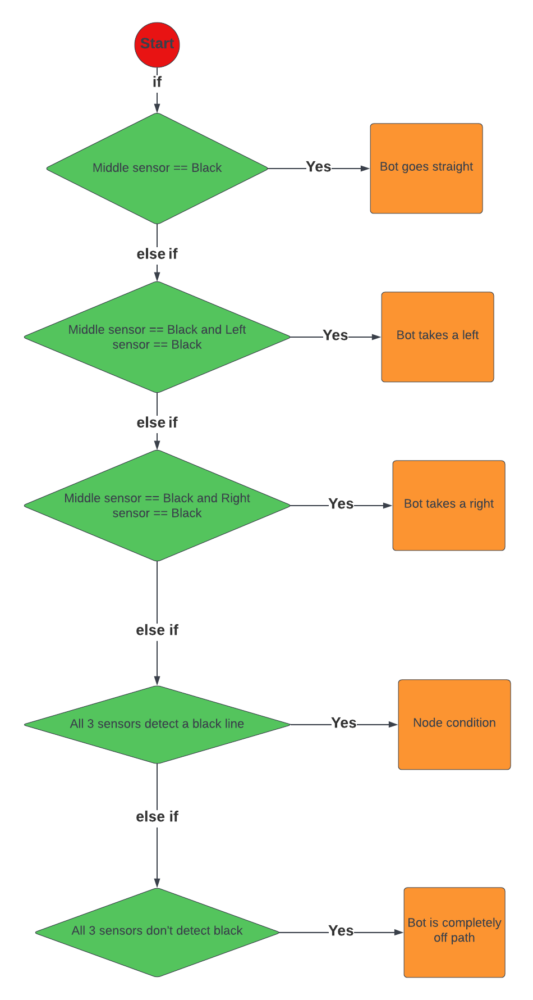
</p>

# Instructions

* This simulation of Wall-E bot is equipped with 3 sensors facing the ground
* Line sensor placement (Bot is "On the Line")
<p align="center">
  
</p>

* Bot is at a Left Turn - LEFT condition

<p align="center">
  
</p>

* Bot is at a Right Turn - RIGHT condition

<p align="center">
  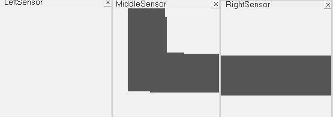
</p>

* Bot is on a Node (All 3 sensors detect the black line) - NODE condition

<p align="center">
  
</p>

* Bot is completely off the line - REVERSE condition

<p align="center">
  
</p>

* Bot is at the end of path - END condition

<p align="center">
  
</p>


# Task
Your Task is to make your bot follow your decided path from the START to the END
* Step 1 : Analyse the maze

<p align="center">
  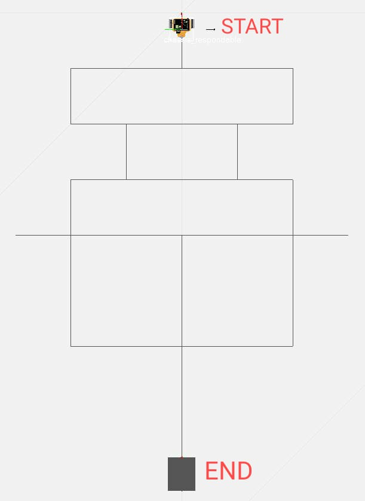
</p>

* Step 2 : Decide which path you want your bot to travel from the START to the END of the maze

* Step 3 : Manually detect all the LEFT/RIGHT/NODE/REVERSE conditions your bot will face on your decided path

* Step 4 : Decide what turns you want to take at each of the above conditions

*  Note  : The turns for REVERSE and END conditions have already been configured for you, you need to decide what turns your bot has to take for the LEFT, RIGHT and NODE conditions

* Step 5 : Once you have the turns decided, start coding in the alloted space (line 123 onwards in 'line_follow.cpp'


# Code Details
* You have been provided a sample framework code to test your solution in
* The code already written in 'line_follow.cpp' contains some helper functions, they are as follows : 
* callTurn() : Helper function to make sure the bot takes the desired turn
        Example call : 
        ```
          all_black_counter = callTurn(clientID,sensorHandle,n,leftmotorHandle,rightmotorHandle,all_black_flag,all_black_counter, sensorValue, LEFT);
        ```
    - Replace the last argument (LEFT) with the turn you want to take (variables to be passed as turns are given below)
* Turn Variables : 
1. **LEFT** : Variable for left turn
2. **RIGHT** : Variable for right turn
3. **REVERSE** : Variable for reversing
4. **STOP** : Variable for stopping
5. **All_BLACK** : Variable for NODE condition (turns Right by Default)
*   Helper Variables :
1. **sensorValue[0]** : Output from the Left sensor
2. **sensorValue[1]** : Output from the Middle sensor
3. **sensorValue[2]** : Output from the Right sensor
4. **all_black_flag** : Has a value of 1 when all three sensors detect a black line
5. **all_black_counter** : Counts the number of times 'all_black_flag' variable has a value of 1 consecutively(one after the other). 
*     (**Note** : If all_black_counter has a value equal to STOP variable, you have to 'break' out of the main While loop)
6. **TURN_MARGIN** : (integer) MINIMUM Output of a sensor when it detects a black line at turns
7. **WHITE_MARGIN** : (integer) MAXIMUM Output of a sensor when it does not detect a line
   


# Run the code
* Step 1 : Open _scenes/WallE_line_follow_maze.ttt_ in V-REP. You should see the Wall-E line-follower path, three vision sensor floating views, and a white floor with a maze line. 
<p align="center">
  
</p>

* Step 2 : Search for cmd in your Start Menu:


* Run the following commands in your cmd


* For Windows :
1. Navigate to the cloned directory in cmd
```
   cd C:\Users\Username\Wall-E-CoppeliaSim\Wall-E-Sim\Task_3
```
<p align="center">
  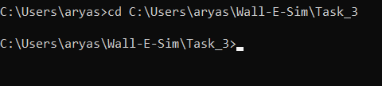
</p>

2. Run the following commands in cmd
```
   cd bin
   cmake -G "MinGW Makefiles" ..
```

Your output will look like this : 
<p align="center">
  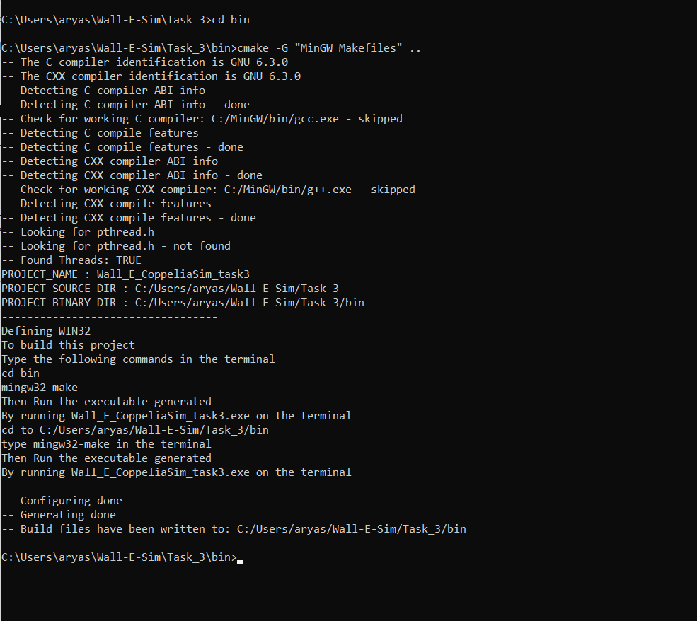
</p>

Do verify that your system is getting identified correctly
<p align="center">
  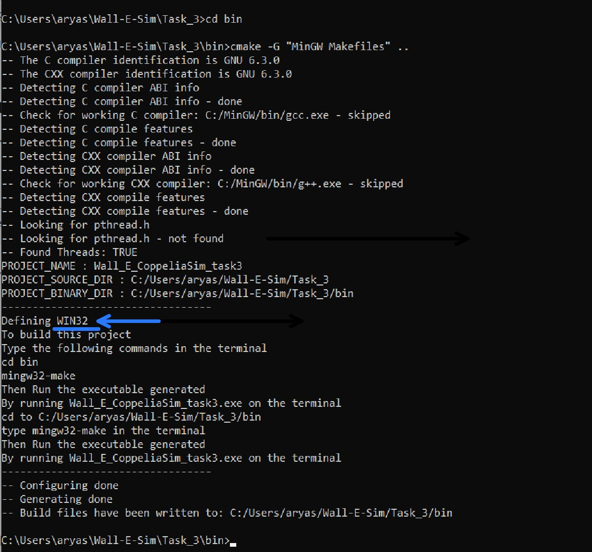
</p>

1. If the output shows no errors, run the following commands in cmd
```
   mingw32-make
```

Your output should look like this :
<p align="center">
  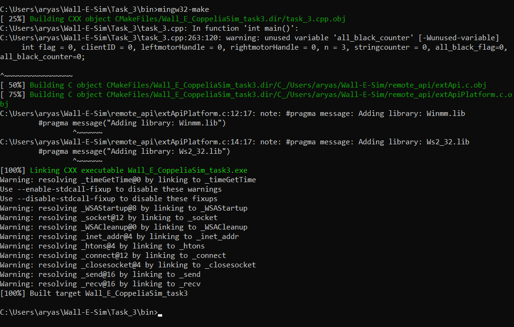
</p>

3 . Now Run the generated executable by typing the following command in cmd and pressing enter
```
      Wall_E_CoppeliaSim.exe
```
Note : You can type W and press tab, the terminal will automatically detect the exe file
Terminal Output : 
<p align="center">
  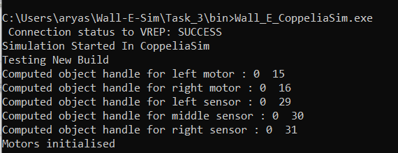
</p>

Your scene output should look like this

<p align="center">
  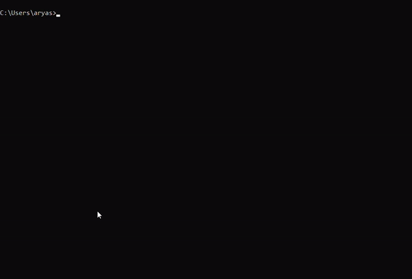
</p>

* For Linux :

1. Navigate to the Directory where you cloned the repository and execute the following commands:
```
   cd <path_to_cloned_directory>
   cd Task_3/bin
   cmake ..
```
If it shows "bash: cd: Wall-E-Coppeliasim/Wall-E-Sim/Task_3/bin: No such file or directory"

```
   cd<path_to_cloned_directory>
   cd Task_3
   mkdir bin
   cd bin
   cmake ..
```

Your output will look like this : 
<p align="center">
  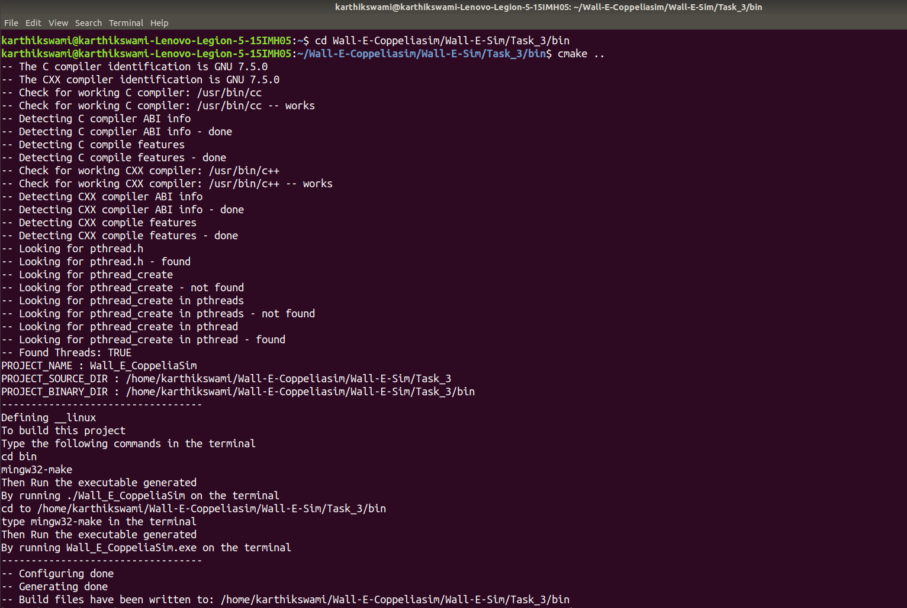
</p>

2. If the output shows no errors, run the following command in your Terminal
```
   make
```

Your output should look like this :
<p align="center">
  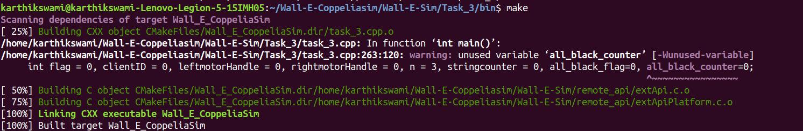
</p>

3 . Now Run the generated executable by typing the following command in your Terminal and pressing enter
 ```
   ./Wall_E_CoppeliaSim
```
Note : You can type ./W and press tab, the terminal will automatically detect the exe file

Terminal Output : 
<p align="center">
  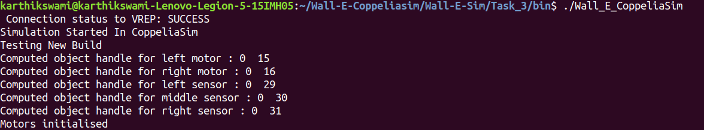
</p>

Your scene output should look like this

<p align="center">
  
</p>
