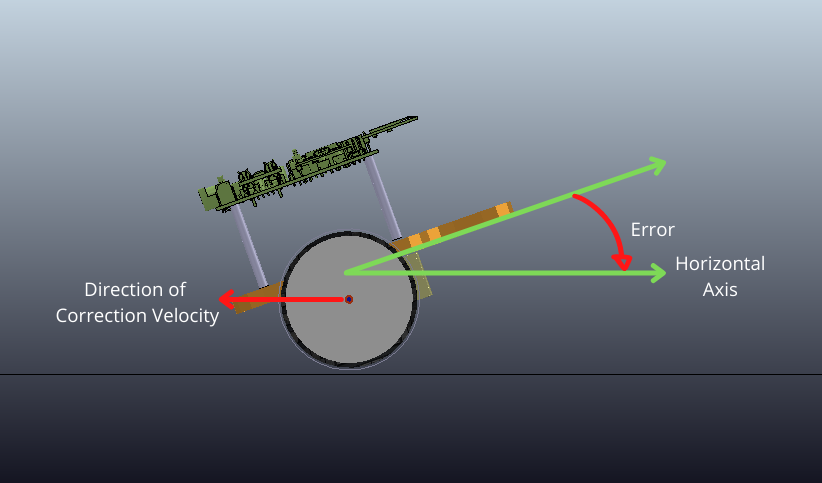
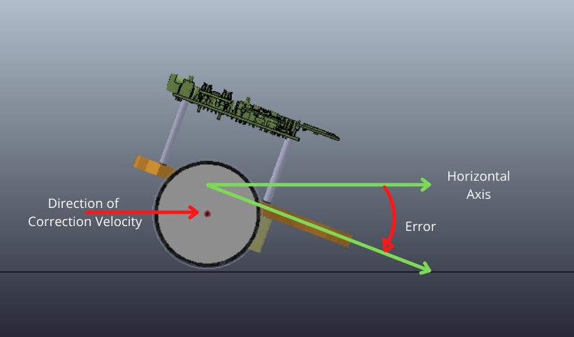
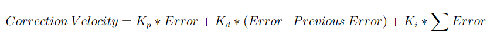
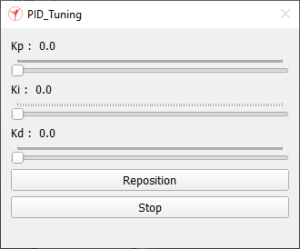
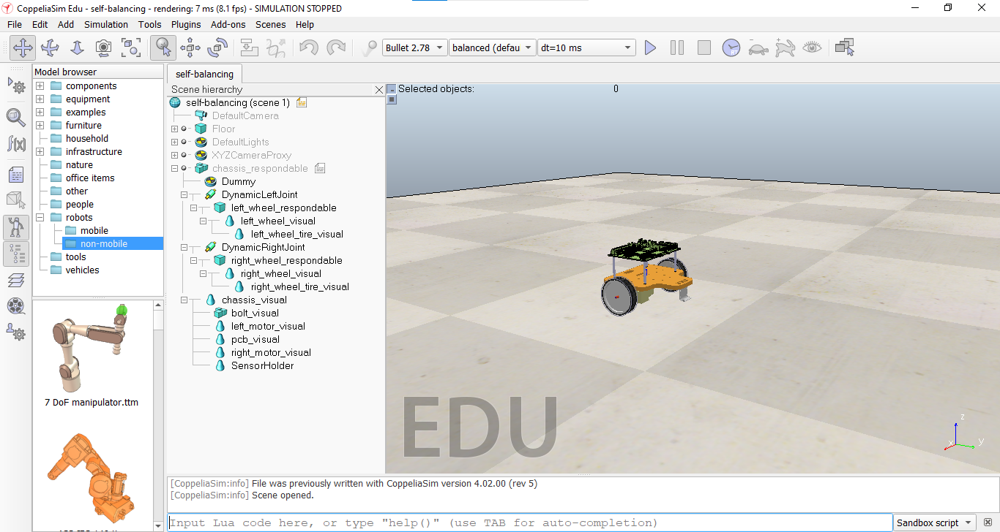
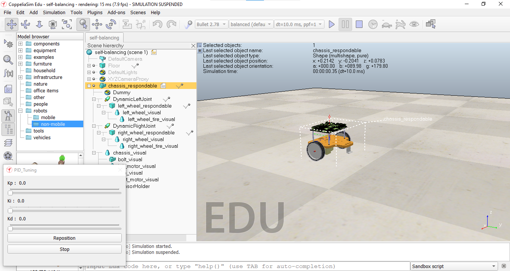
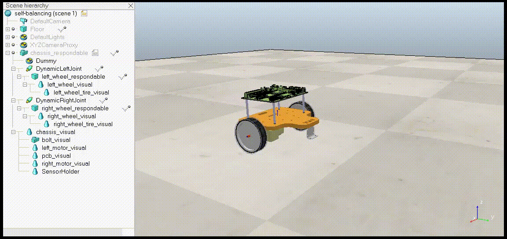

# Installation (if not done already)


* Clone this git repository :
```
  git clone https://github.com/SRA-VJTI/Wall-E-Sim.git
```

**NOTE :** If you have already Cloned, run the following commands to get the updated version of the repository :<br>

* Open the terminal (For Windows - Command Prompt cmd)
* Go to the cloned directory (Wall-E-Coppeliasim/Wall-E-Sim) and run the following command

```
  git --version
  git pull
``` 

# Wall-E-Sim : Task 4
The aim of the task is to simulate the Self Balancing of Wall-E Bot using the PID Algorithm.

* First we calculate the error ie. the deviation of the Bot from the horizontal axis.

<p align="center">
  
</p>

<p align="center">
  
</p>

* Next, we calculate the velocity using PID equation.

<p align="center">
  
</p>

* This velocity is given to motors of Wall-E bot in order to balance it.

# Task
Your Task is to perform Self-Balancing of Wall-E bot by tuning the PID Equation Parameters using sliders provided.

<p align="center">
  
</p>

# Running the Scene File

* Step 1 : Navigate to the folder where you have cloned the repository. Open _Task_4/self-balancing.ttt_ in CoppeliaSim. 

  <p align="center">
    
  </p>

* Step 2 : In the opened scene file , click on `Start\Resume Simulation` Button. Slider UI for tuning PID will appear to left of your scene. 

  <p align="center">
    
  </p>
  
* Step 3 : You task is to tune the PID values to balance the Wall-E Bot. If the Bot starts to go out of the scene boundary, use the `Reposition` Button.
  
  Sample Output :
  <p align="center">
      
  </p>
  
